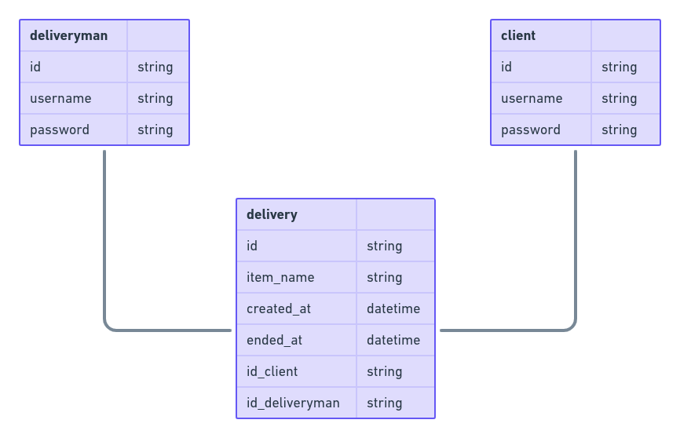
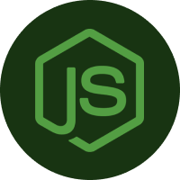

<h1 align="center">Dely API</h1>

## About
Dely is a API service that connects the client and his delivery with a deliveryman. The main pourpose of the project was the learn all the basics of the Prisma ORM.

## Diagram
Here's the diagram of the existent models.

## Technologies
### Node JS

### Prisma ORM

### Express

## How to use it
First you need to clone the project from github using the command `git clone https://github.com/Eduardo-H/dely.git`, then enter the project's directory using `cd dely/`. After that you can run `yarn` to install all the dependencies, before you run the project you'll need to create a `.env` file on the project's root directory (the template is available on the `.env.example` file). Finally, you can run the project using `yarn dev`.